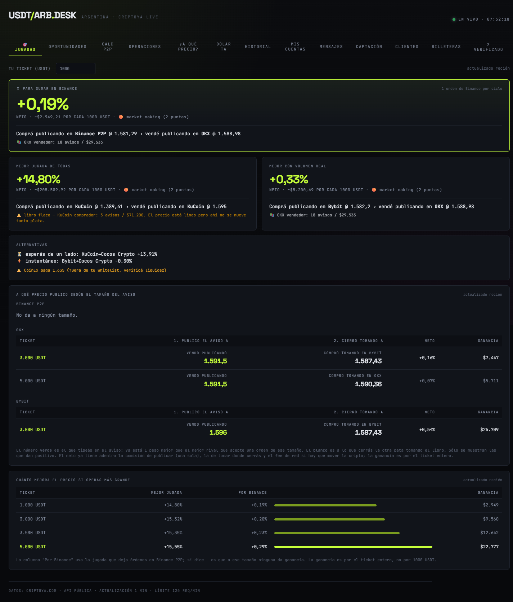
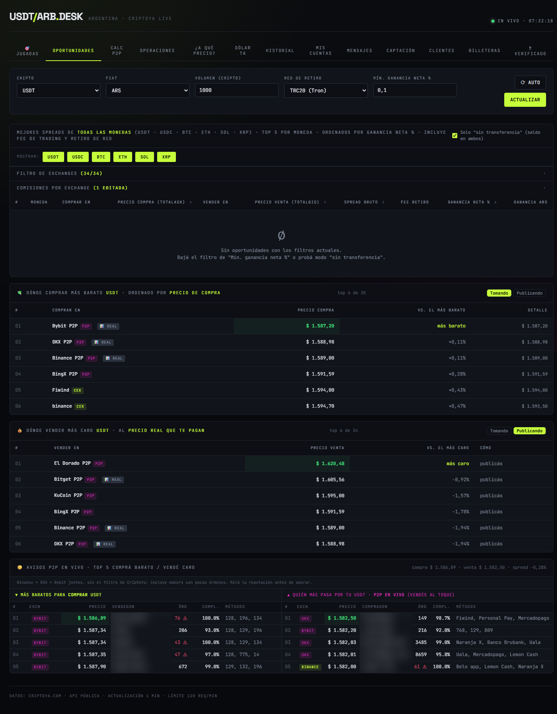
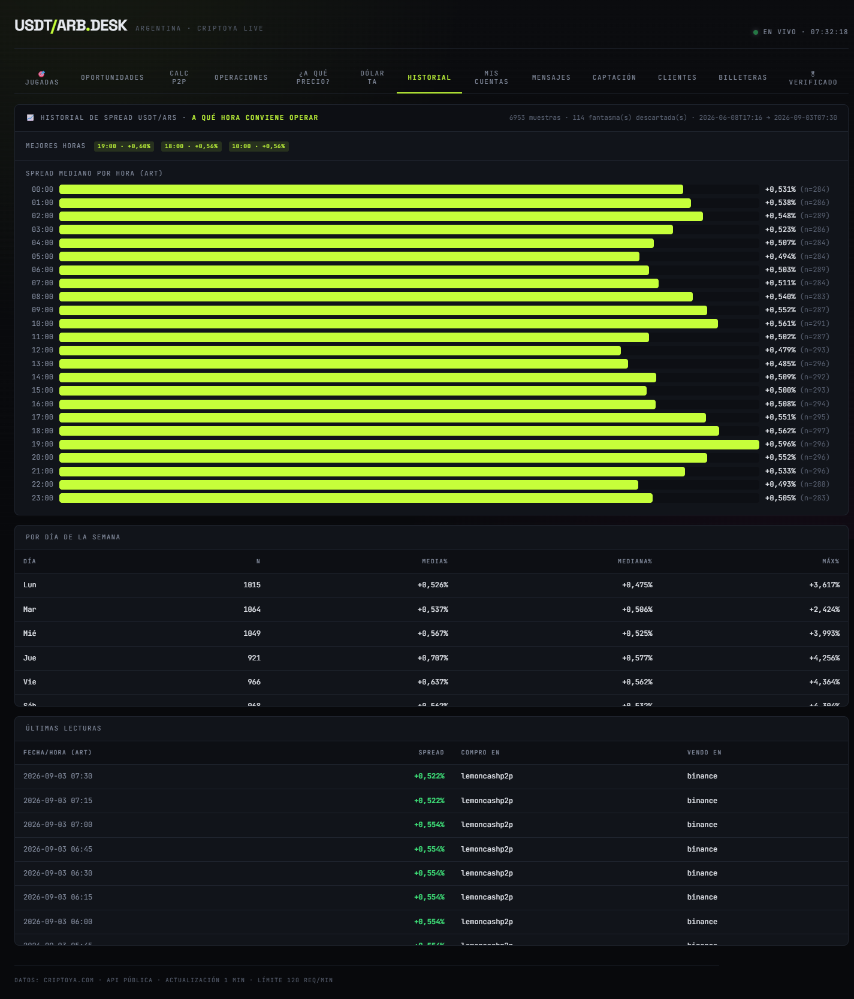
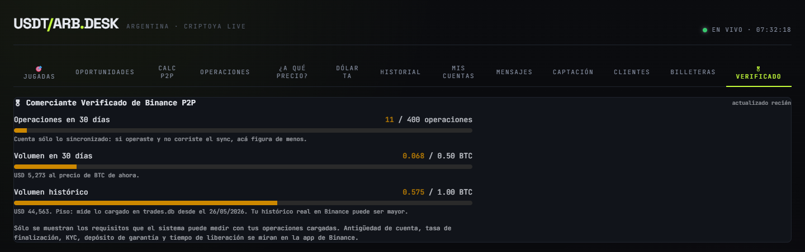
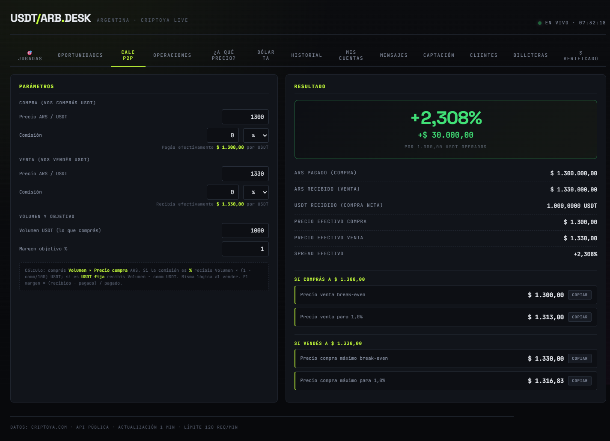
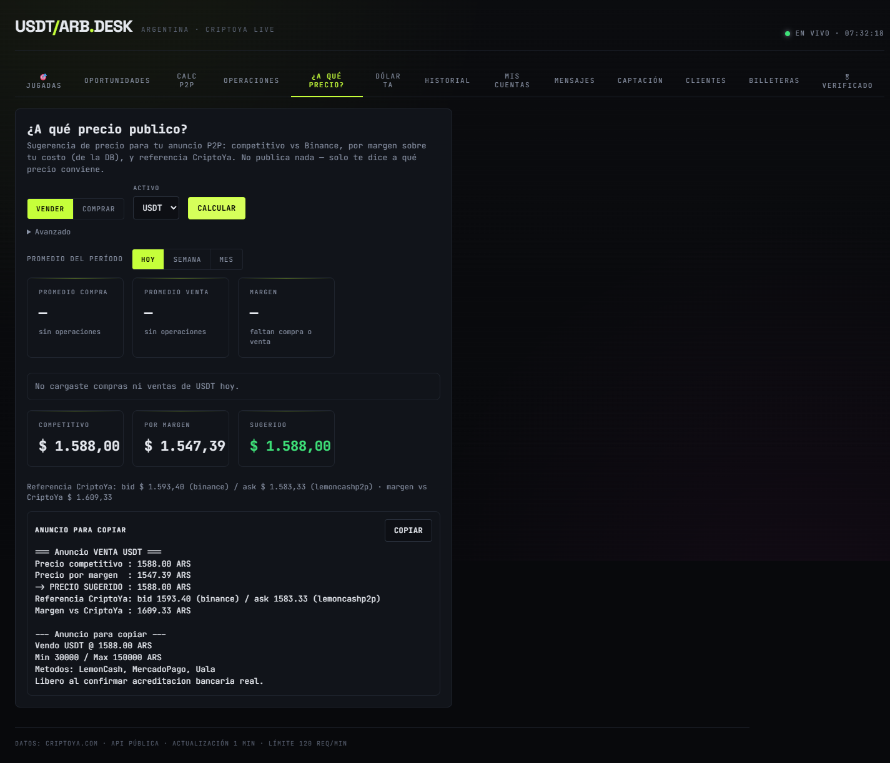
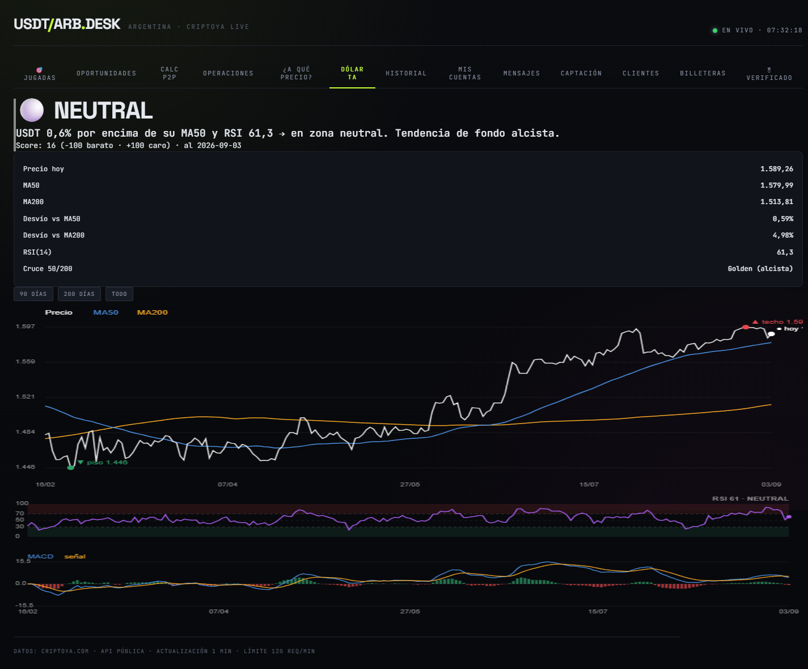

# P2P Arbitrage Desk

Mesa de trabajo para arbitraje **USDT / BTC contra pesos argentinos (ARS)** en
mercados P2P. Lee los libros de varios exchanges, calcula el precio que de verdad
podés ejecutar para tu tamaño de orden y te dice qué jugada deja plata **después
de comisiones**.

Lo armé para mi propia operatoria y lo comparto gratis para que otros
arbitradores lo usen, lo rompan y lo mejoren.

> **No es asesoramiento financiero.** Es una herramienta de análisis. Las
> decisiones y la plata son tuyas.

## ⭐ Tus operaciones se guardan solas en Google Sheets

Lo que todo arbitrador termina necesitando: **dejar de pasar órdenes a mano a la
planilla.**

Con un comando, o con un clic en el dashboard si dejás corriendo el agente de
escritorio (`companion/`), el sistema trae **todas tus órdenes P2P completadas** de Binance y Bybit por API de solo lectura y las escribe en tu
planilla de Google, en la pestaña del mes, ventas de un lado y compras del otro.

- **Sin tipear nada**: fecha, ID de orden, USDT, total en pesos, exchange y medio
  de pago salen de la orden real.
- **Con la comisión real** que te cobró el exchange, no una estimada.
- **Sin duplicar**: cada orden se reconoce por su ID. Podés correrlo las veces que
  quieras.
- **No pisa tus fórmulas**: solo completa las columnas de entrada. Comisión, neto
  y promedio los sigue calculando tu planilla.
- **También por captura**: para los exchanges sin API, mandás la foto de la
  operación por Telegram y se carga sola.
- Todo queda además en una base SQLite local, que alimenta el dashboard, el
  promedio de compra y venta del día y el control mensual por billetera.

Cómo conectarlo está en [Conectar tu planilla de Google](#conectar-tu-planilla-de-google).

## Qué hace

- **Precio ejecutable, no el de vidriera.** Camina el libro P2P respetando el
  mínimo y el máximo de cada aviso, filtra los avisos anzuelo y te da el precio
  promedio real para el monto que querés mover.
- **Jugadas netas de comisiones.** Compara tomar contra publicar, dentro de un
  exchange y entre exchanges, con la comisión de cada modo y el fee de red ya
  descontados. El fee fijo por orden se cobra por cada aviso que hace falta
  tomar, y el motor elige el llenado que más rinde neto.
- **Descarta libros sin volumen.** Un 2% sobre un libro que no opera rinde cero.
- **Buscador de rutas ARS → … → ARS** rankeadas por plata por hora, no por
  porcentaje.
- **Prima de BTC y altcoins** contra USDT, traducida a tipo de cambio implícito
  para poder compararlas.
- **Carga automática de operaciones** a tu planilla de Google y a SQLite, por API
  de solo lectura o por captura. Ver la sección de arriba.
- **Dashboard web** con jugadas, oportunidades, operaciones, clientes y control
  mensual por billetera.
- **Bot de Telegram** con comandos, cotizador para clientes y alertas de spread
  con un piso configurable.
- **Progreso hacia Comerciante Verificado** de Binance P2P.

Fetchers P2P públicos incluidos: Binance, OKX, Bybit, Bitget y KuCoin. Los
exchanges locales salen de CriptoYa.

## Cómo se ve

**Jugadas**: la mejor jugada ahora, neta de comisiones, con la curva por tamaño de ticket.



**Oportunidades**: dónde comprar más barato y dónde vender más caro, con los avisos P2P en vivo.



**A qué hora conviene operar**: spread mediano por hora y por día, sobre el histórico propio.



**Progreso hacia Comerciante Verificado de Binance P2P**, medido sobre tus operaciones cargadas.



<details>
<summary>Más pantallas</summary>

**Calculadora P2P**



**¿A qué precio publico?**



**Análisis técnico del dólar cripto**



</details>

## Arrancar en 5 minutos

Necesitás Python 3.11 o superior.

```bash
git clone <URL-de-este-repo>
cd <carpeta-del-repo>
python -m venv .venv
# Windows: .venv\Scripts\activate      Linux/Mac: source .venv/bin/activate
pip install -r requirements.txt
cp .env.example .env
python -m uvicorn webapp.server:create_app --factory --host 127.0.0.1 --port 8000
```

Abrí `http://127.0.0.1:8000`. En Windows también podés hacer doble clic en
`run_dashboard.bat`.

**Arranca sin ninguna credencial**: los precios y las jugadas usan endpoints
públicos. Todo lo demás es opcional y se prende completando el `.env`:

| Querés… | Completá en `.env` |
|---|---|
| Traer tus órdenes de Binance o Bybit | `BINANCE_API_KEY` / `BYBIT_API_KEY` y sus secrets, **siempre de solo lectura** |
| Guardar también en una planilla de Google | `GOOGLE_SERVICE_ACCOUNT_JSON` y `SHEET_ID` |
| Bot y alertas por Telegram | `TELEGRAM_BOT_TOKEN` y `TELEGRAM_CHAT_ID` |
| Que el vigilante ignore tus propios avisos | `MIS_NICKS_P2P` |
| Tu marca en la placa de cotización | `BRAND_NAME` |

Tus cuentas para copiar en el chat de cada orden se editan en el bloque
`ACCOUNTS` de `dashboard.html`. Si ponés datos reales, trabajá sobre una copia
llamada `dashboard.local.html`, que ya está en `.gitignore`.

## Conectar tu planilla de Google

1. En Google Cloud creá una **service account**, habilitá la API de Google Sheets
   y bajá su archivo JSON. Guardalo en la carpeta del proyecto como
   `service-account.json`. Ya está en `.gitignore`.
2. Abrí tu planilla y **compartila como Editor** con el mail de esa service
   account.
3. En `.env` completá `SHEET_ID` con el ID que aparece en la URL de la planilla.
4. La planilla necesita **una pestaña por mes con el nombre en español**
   (`Enero`, `Febrero`, …). En cada pestaña la fila 1 son encabezados, la fila 2
   son totales y los datos arrancan en la fila 3. Las ventas van desde la columna
   A y las compras desde la columna K, con este orden en cada bloque:
   `Fecha · ID · USD bruto · Comisión · USD neto · Promedio · Total ARS ·
   Exchange/Cripto · Banco`. El sistema escribe todas menos Comisión, USD neto y
   Promedio, que son tus fórmulas.
5. Cargá las API keys **de solo lectura** de Binance o Bybit en `.env`.

Para traer tus órdenes:

```bash
python -m cli.sync_binance --today    # muestra qué hay nuevo y pide confirmación
python -m cli.sync_bybit
```

Si falta la pestaña del mes, el sistema te avisa cuál crear y no escribe nada a
medias. Sin planilla configurada todo funciona igual y se guarda solo en SQLite.

## Comandos útiles

```bash
python -m cli.prima_alt          # prima de BTC y alts contra USDT, en vivo
python -m cli.rutas              # todas las rutas ARS→ARS, por plata por hora
python -m cli.prepare_ad         # a qué precio publicar un aviso
python -m cli.cotizar_cliente 500000 --asset USDT   # cotizarle a un cliente
python -m cli.spread_alert       # una pasada de alertas a Telegram
python -m pytest -q              # la suite entera
```

## Cómo está armado

```
config.py          comisiones por exchange y por modo, listas blanca y negra, umbrales
p2p_scanner.py     fetchers P2P públicos
core/              motores puros, sin red, con tests
cli/               comandos de terminal
webapp/server.py   FastAPI: sirve el dashboard y las /api/*
bot/               bot de Telegram
companion/         agente de escritorio: trae tus órdenes desde una IP residencial
deploy/            units de systemd y guías para correrlo 24/7 en un servidor
docs/              investigaciones de mercado con los números crudos
```

Los motores de `core/` no tocan la red: por eso se testean sin mocks de HTTP.
La suite tiene más de 1.100 tests.

## Reglas que el sistema nunca rompe

1. **Nunca liberar cripto con un comprobante o una captura.** Se libera cuando la
   plata impactó de verdad en tu cuenta. Ninguna automatización saltea ese paso.
2. **Las API keys son de solo lectura.** Este proyecto no retira fondos ni
   publica avisos por vos.
3. **Solo exchanges con libro real y retiro a pesos.** Las billeteras de remesa
   están en lista negra aunque muestren buen precio.
4. **Las comisiones viven en `config.py`.** Cambian seguido: verificalas contra
   la página de cada exchange antes de operar.

## Usarlo con Claude Code

El repo trae un `CLAUDE.md` y skills en `.claude/skills/` para manejarlo hablando
en criollo: "¿qué hago ahora?", "prepará un anuncio", "cargá esta captura".

## Licencia

MIT. Usalo, copialo y modificalo. Si te sirve, una estrella ayuda.
